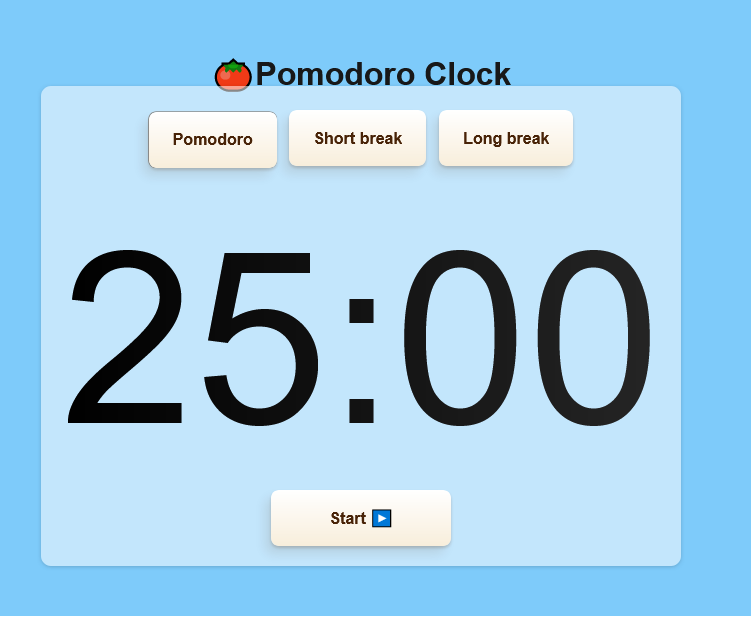

# Herramientas de productividad
Esta es una aplicación inspirada en diferentes herramientas de productividad: técnica de Pomodoro.

## Tabla de contenidos
- [Demostración](#demostración)
- [Características](#características)
- [Tecnologías](#tecnologías)
- [Instalación](#instalación)
- [Usabilidad](#usabilidad)
- [Contribución](#contribución)
- [Licencia](#licencia)

## Demostración
Puedes ver la aplicación en funcionamiento <a href="https://proyectosprogramacion.github.io/javascript_herramientasproductividad/" target="_blank" rel="noreferrer">aquí.</a>

## Características
- **Reloj pomodoro**: Muestra un reloj que permite gestionar el tiempo trabajando en intervalos de 25 minutos, sin interrupción ni distracciones.
- **Lista de tareas pendientes**:  es una lista de cosas por hacer.
- **Formuario**:documento elaborado para que un usuario introduzca datos estructurados en las zonas correspondientes, para ser almacenados y procesados posteriormente.

## Tecnologías
- HTML5
- CSS3
- JavaScript

## Instalación
1. Clone this repository to your local machine.

2. Open the `index.html` file in your web browser to start using the Pomodoro Clock.

## Usabilidad
1. Set your desired work and break durations.
2. Click the "Start" button to begin a Pomodoro session.
3. The timer will count down, and you'll hear a notification when the session ends.
4. Take a break, or start another session by clicking "Start" again.

## Contribución
Feel free to contribute to the project by opening issues or submitting pull requests. Your contributions are welcomed and appreciated!

## Licencia
This project is licensed under the MIT License.
