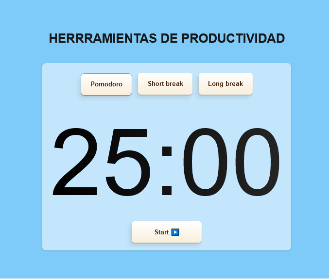

# Herramientas de productividad
Esta es una aplicación inspirada en diferentes herramientas de productividad: técnica de Pomodoro, lista de tareas y un formulario.

## Tabla de contenidos
- [Demostración](#demostración)
- [Características](#características)
- [Tecnologías](#tecnologías)
- [Usabilidad](#usabilidad)
- [Licencia](#licencia)

## Demostración
Puedes ver la aplicación en funcionamiento <a href="https://proyectosprogramacion.github.io/javascript_herramientasproductividad/" target="_blank" rel="noreferrer">aquí.</a>

## Características
- **Reloj pomodoro**: muestra un reloj que permite gestionar el tiempo trabajando en intervalos de 25 minutos, sin interrupción ni distracciones.
- **Lista de tareas pendientes**:  es una herramienta que nos permite construir una lista de cosas pendientes de hacer.
- **Formuario**:  es un documento elaborado para que un usuario introduzca datos estructurados en las zonas correspondientes, para ser almacenados y procesados posteriormente.

## Tecnologías
- HTML5
- CSS3
- JavaScript

## Usabilidad
1. Puedes clonarte el repositorio en tu maquina local.

2. Abriendo el `index.html`  en tu navegador, puedes empezar a utilizarlas.

## Licencia
Licencias Creative Commons. Dominio público (CC0). Si se crea una obra derivada, debe distribuirse bajo la misma licencia que la obra original.